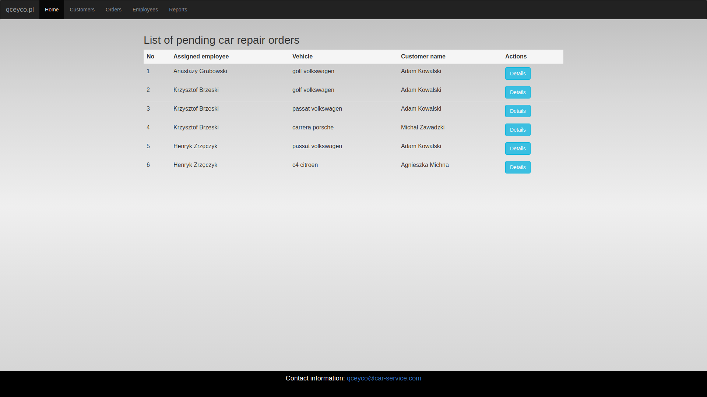
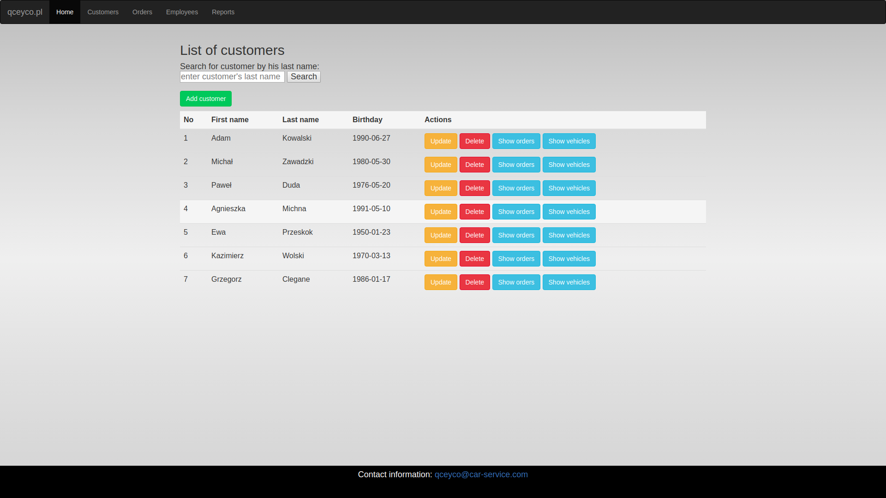
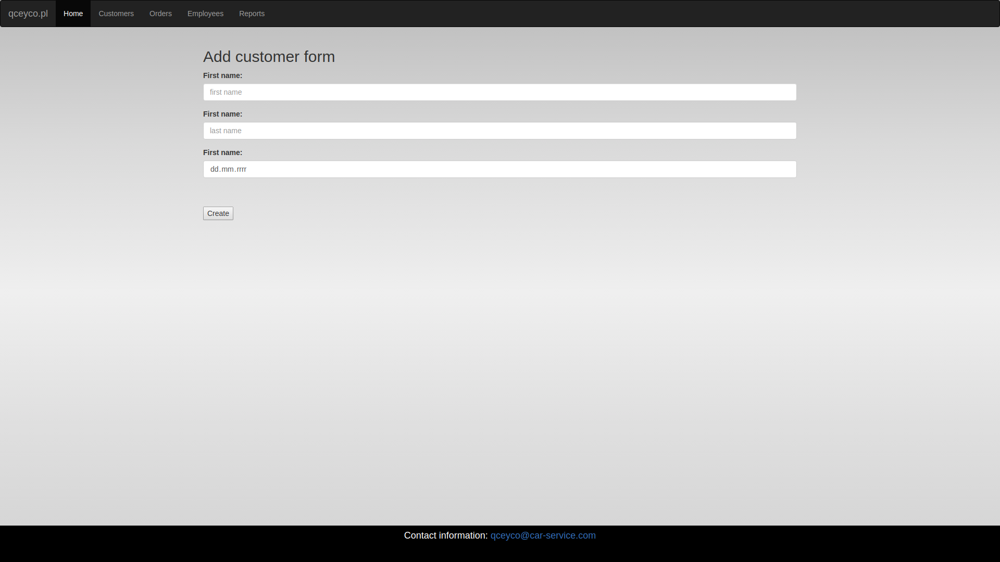
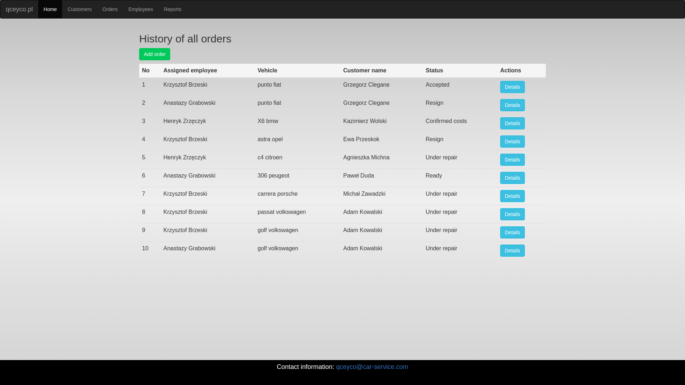
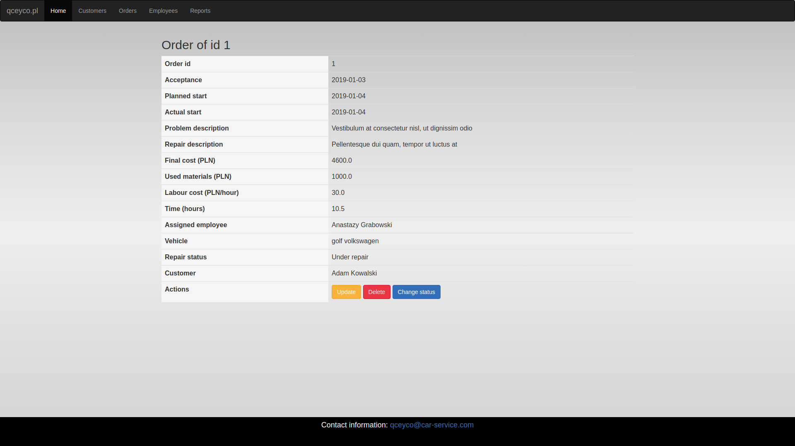
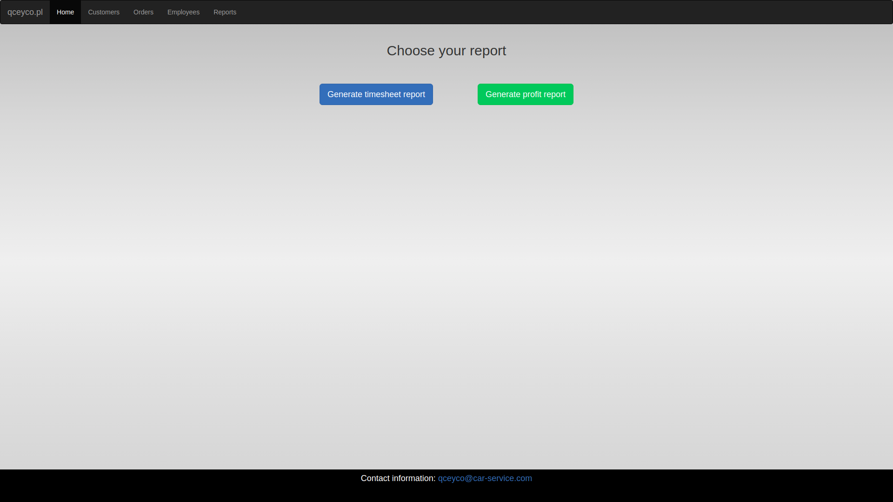
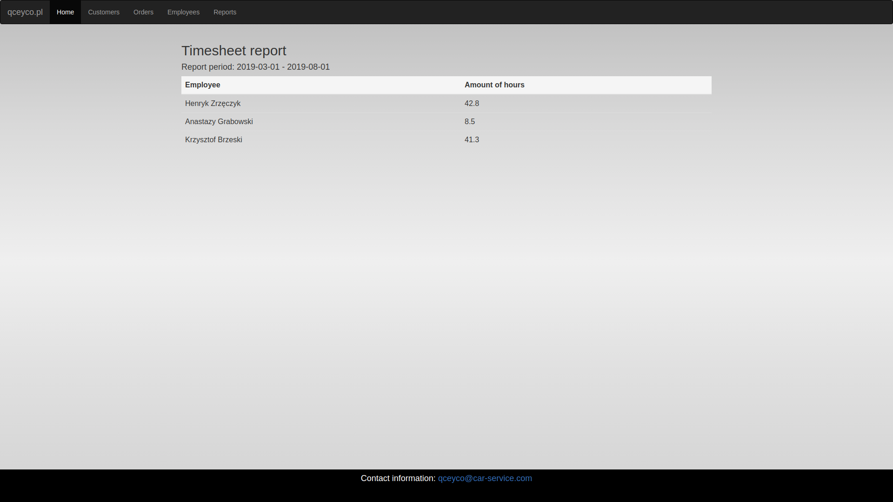

# CarServiceStationCRM

This is a basic web application which was created in Java using Servlet technology, MySQL and Bootstrap. Views were developed with jsp files. This application could be used e.g. by a car service station as customer relationship management tool. User may add such data as new client, new order, details etc. User may also generate a report. For presentation purposes I have added several views of the application.

#### Home

#### List of customers

#### Adding new customer

#### History of orders

#### Order details

#### Choosing a report

#### Generated report - work time

